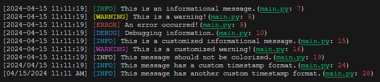

# Logifyr

Author: **Prashant Bhandari**

``Logifyr`` is a Python class designed to facilitate logging with customizable timestamp formats and colored output. It extends the functionality of the [``TextArtisan``](https://github.com/prashantbhandari128/text-artisan) module.

## Logifyr Class Documentation

### Variables

- `status_colors`
  - **Description:** Dictionary mapping log statuses to their corresponding colors for colored output.
  - **Type:** dict
  - **Default Value:**
    ```python
    {
        "INFO": "green",
        "WARNING": "yellow",
        "ERROR": "red",
        "DEBUG": "blue"
        # Add more statuses and corresponding colors as needed
    }
    ```
### Methods

- `__init__(timestamp_format="%Y-%m-%d %H:%M:%S", color_enabled=True)`
  - **Description:** Constructor method for initializing a ``Logifyr`` instance.
  - **Parameters:**
    - `timestamp_format`: str - Optional. Format for the timestamp. Defaults to ``"%Y-%m-%d %H:%M:%S"``.
    - `color_enabled`: bool - Optional. Flag to enable or disable colorized output. Defaults to ``True``.

- `print_log(status, message)`
  - **Description:** Prints a log message with the specified status and message.
  - **Parameters:**
    - `status`: str - The status of the log message (``"INFO"``, ``"WARNING"``, ``"ERROR"``, ``"DEBUG"``).
    - `message`: str - The log message to be printed.

- `set_status_color(status, color)`
  - **Description:** Sets the color for a specific log status.
  - **Parameters:**
    - `status`: str - The log status for which to set the color.
    - `color`: str - The color to be set for the specified status.

- `set_timestamp_format(timestamp_format)`
  - **Description:** Sets the format for the timestamp.
  - **Parameters:**
    - `timestamp_format`: str - The format string for the timestamp.

- `enable_color()`
  - **Description:** Enables colorized output for log messages.

- `disable_color()`
  - **Description:** Disables colorized output for log messages.

## Installation

No additional installation steps are necessary. Simply include the ``logifyr.py`` and ``text_artisan.py`` file in your project.

## Usage

### Importing ``Logifyr``

```python
from logifyr import Logifyr
```

### Creating an Instance

```python 
# Create a Logifyr instance with default settings
logger = Logifyr()

# You can also customize the timestamp format and color output
logger = Logifyr(timestamp_format="%Y-%m-%d %H:%M:%S", color_enabled=True)
```

### Printing Logs

```python
# Print a log message with the specified status
logger.print_log("INFO", "This is an informational message.")

# Available log statuses: "INFO", "WARNING", "ERROR", "DEBUG"
```

### Customizing Log Settings

```python
# Set color for a specific status
logger.set_status_color("INFO", "cyan")

# Set a custom timestamp format
logger.set_timestamp_format("%Y-%m-%d")

# Enable or disable colorized output
logger.enable_color()
logger.disable_color()
```

## Example usage of ``Logifyr``

### **Code :**

```python
from logifyr.logifyr import Logifyr

if __name__ == "__main__":
    # Create an instance of Logifyr
    logger = Logifyr()
    # Test the log function with different statuses
    logger.print_log("INFO", "This is an informational message.")
    logger.print_log("WARNING", "This is a warning!")
    logger.print_log("ERROR", "An error occurred!")
    logger.print_log("DEBUG", "Debugging information.")
    # Customize status colors (example)
    logger.set_status_color("INFO", "cyan")
    logger.set_status_color("WARNING", "magenta")
    # Test with customized status colors
    logger.print_log("INFO", "This is a customized informational message.")
    logger.print_log("WARNING", "This is a customized warning!")
    # Disable colorized output
    logger.disable_color()
    logger.print_log("INFO", "This message should not be colorized.")
    logger.enable_color()
    # Set a different timestamp format
    logger.set_timestamp_format("%Y/%m/%d %H:%M:%S")
    # Test with the new timestamp format
    logger.print_log("INFO", "This message has a custom timestamp format.")
    # Set a another timestamp format
    logger.set_timestamp_format("%m/%d/%Y %I:%M %p")
    # Test with the another timestamp format
    logger.print_log("INFO", "This message has another custom timestamp format.")
```
### **Output :**



## References

- [TextArtisan](https://github.com/prashantbhandari128/text-artisan)